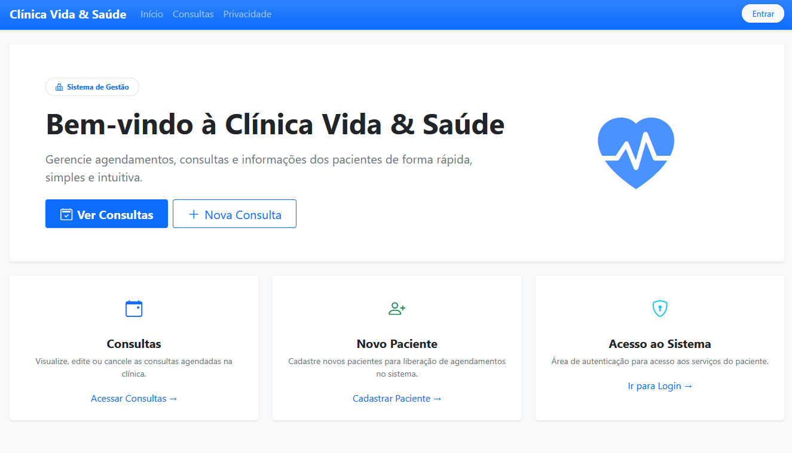
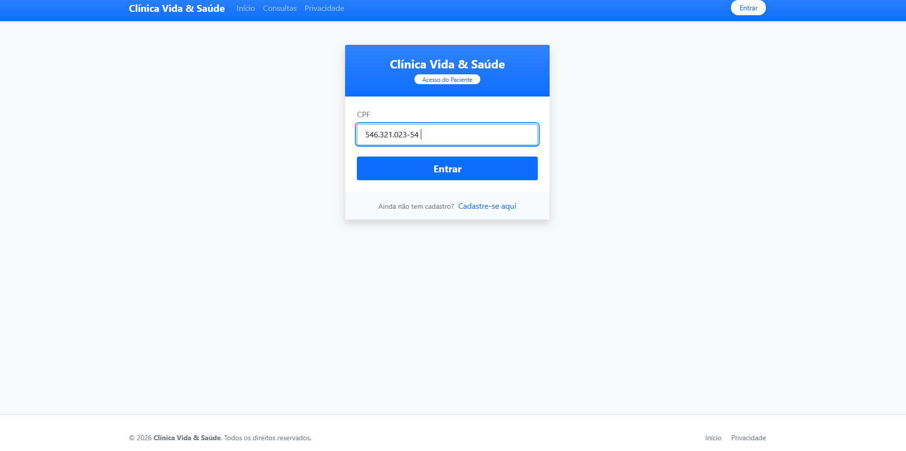
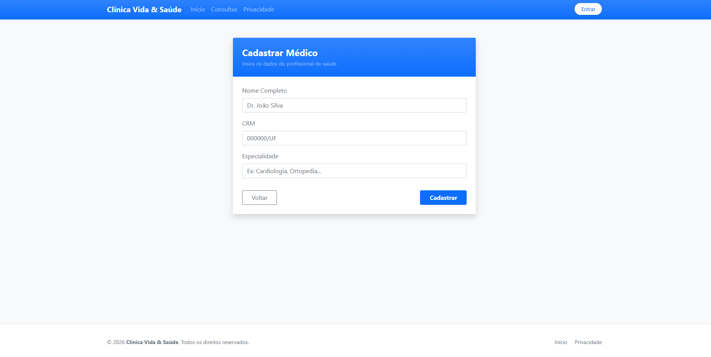
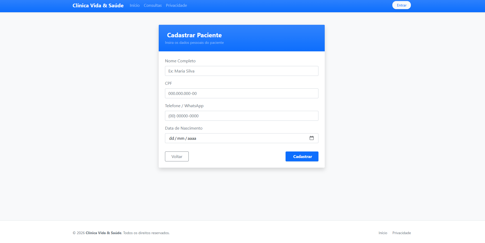
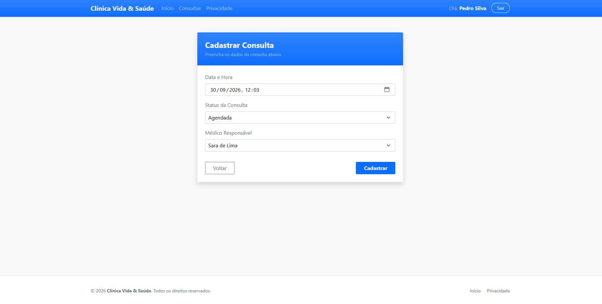
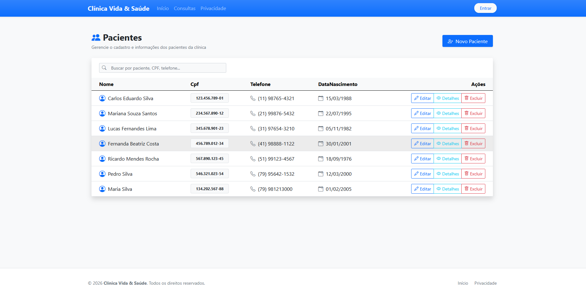
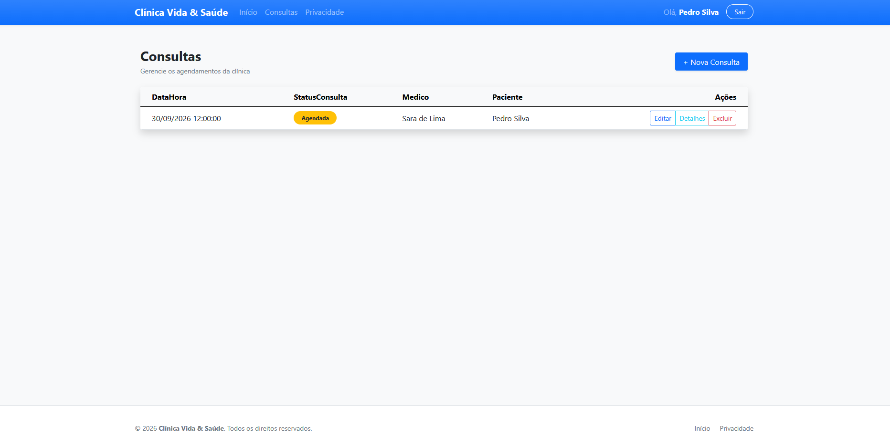
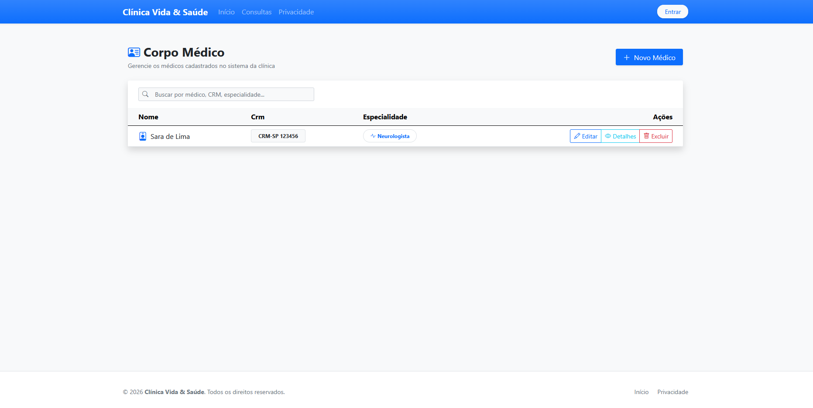

# 🩺 Clínica Vida & Saúde (appReversotask1)

Sistema de Gestão Clínica desenvolvido em **ASP.NET Core MVC** utilizando a linguagem **C#**, o padrão arquitetural **Model-View-Controller (MVC)**, persistência com **Entity Framework Core** e autenticação via **Cookies e Session**.

O projeto tem como objetivo demonstrar a implementação de um sistema completo para gerenciamento clínico, incluindo controle de médicos, pacientes, especialidades, medicamentos e agendamento de consultas, além de autenticação simplificada por CPF com tratamento flexível de máscaras e interface moderna e responsiva.

---

## 📋 Tecnologias Utilizadas

- C#
- .NET
- ASP.NET Core MVC
- SQL Server
- Entity Framework Core
- Bootstrap 5
- Bootstrap Icons
- JavaScript (Filtros dinâmicos e máscaras)
- jQuery

---

## 📦 Pacotes Utilizados

O projeto utiliza os seguintes pacotes do Entity Framework Core e ferramentas do ecossistema .NET:

- `Microsoft.EntityFrameworkCore`
- `Microsoft.EntityFrameworkCore.SqlServer`
- `Microsoft.EntityFrameworkCore.Tools`
- `Microsoft.EntityFrameworkCore.Design`
- `Microsoft.VisualStudio.Web.CodeGeneration.Design`

---

## 🗄 Banco de Dados

O banco de dados foi desenvolvido utilizando o **SQL Server** através do contexto `DbClinicaContext`.

A criação e evolução do banco de dados foram realizadas utilizando a abordagem **Code First** com **Migrations** do Entity Framework Core, garantindo o versionamento de dados das entidades do sistema.

---

## 🚀 Funcionalidades

- **Autenticação por CPF & Cookie:** Sistema de login para pacientes com sanitização automática de caracteres (`Regex`), permitindo autenticação com ou sem pontuação no CPF.
- **Gerenciamento de Médicos (CRUD):**
  - Cadastro, edição, listagem e exclusão de médicos.
  - Busca em tempo real por nome, CRM ou especialidade sem recarregar a página.
- **Gerenciamento de Pacientes (CRUD):**
  - Cadastro completo com validação, CPF, telefone e data de nascimento.
  - Tabela responsiva com filtro instantâneo via JavaScript.
- **Gestão de Consultas, Medicamentos e Especialidades:**
  - Agendamento e acompanhamento das consultas clínicas.
- **Interface e Usabilidade:**
  - Design padronizado em **Cards** com cantos arredondados (`rounded-4`), sombras sutis, gradientes de destaque e ícones do **Bootstrap Icons**.
  - Confirmações visuais para ações destrutivas (exclusões).

---

## 🎨 Interface

A interface do sistema foi remodelada focando em usabilidade e estética profissional:

- **Bootstrap 5** (Layouts em card, formulários adaptativos e componentes de alerta)
- **Bootstrap Icons** (Ícones contextuais em tabelas, botões e cabeçalhos)
- **Razor Views** (Renderização dinâmica das telas)
- **Filtros e Validações no Client-Side**

---

# 📷 Telas do Sistema

## Tela Inicial



---

## Tela de Login (Acesso do Paciente)



---

## Cadastro dos Médicos



---

## Cadastro dos Pacientes



---

## Cadastro das Consultas



---

## Gerenciamento de Pacientes



---

## Gerenciamento de Consultas



---

## Gerenciamento de Médicos



---

# ▶️ Como Executar o Projeto

## 1. Clone o repositório

```bash
git clone [https://github.com/AnnaLuiza17/appReversotask1.git]
```

## 2. Abra a solução
Abra o arquivo de solução (appReversotask1.sln) utilizando o Visual Studio 2022.

## 3. Configure a Conexão com o Banco de Dados
Edite o arquivo
```appReversotask1/appsettings.json```
e ajuste a string de conexão ConexaoSqlServer:
```"ConnectionStrings": {"ConexaoSqlServer": "Server=SEU_SERVIDOR;Database=DbClinica;Trusted_Connection=True;TrustServerCertificate=True;"}```

## 4. Execute as Migrations
No Console do Gerenciador de Pacotes (Package Manager Console), execute:

PowerShell
```Update-Database```

Ou via .NET CLI:

```bash
dotnet ef database update
```
---

## 5. Execute o projeto
Pressione F5 ou clique no botão Iniciar no Visual Studio.

## 📂 Estrutura do Projeto

```
appReversotask1/
│
├── Connected Services/
├── Dependências/
├── Properties/
├── wwwroot/
│
├── Controllers/
│   ├── AccountController.cs
│   ├── ConsultaController.cs
│   ├── HomeController.cs
│   ├── MedicoController.cs
│   └── PacienteController.cs
│
├── Models/
│   ├── Consulta.cs
│   ├── DbClinicaContext.cs
│   ├── ErrorViewModel.cs
│   ├── Especialidade.cs
│   ├── LoginViewModel.cs
│   ├── Medicamento.cs
│   ├── Medico.cs
│   └── Paciente.cs
│
├── Views/
│   ├── Account/
│   │   └── Login.cshtml
│   ├── Consulta/
│   ├── Home/
│   │   ├── Index.cshtml
│   │   └── Privacy.cshtml
│   ├── Medico/
│   ├── Paciente/
│   ├── Shared/
│   ├── _ViewImports.cshtml
│   └── _ViewStart.cshtml
│
├── appsettings.json
└── Program.cs
```
---

# 💻 Desenvolvido com
- ASP.NET Core MVC (.NET 8.0)
- C#
- Entity Framework Core
- SQL Server
- Cookie & Session Authentication
- Bootstrap 5 & Bootstrap Icons
- 
---

# 👨‍💻 Autores
### Desenvolvedor

**Anna Luíza Watanabe**

### Professor / Orientador

**Wallace Oliveira dos Santos**
